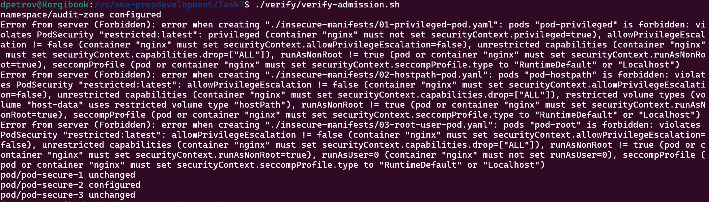
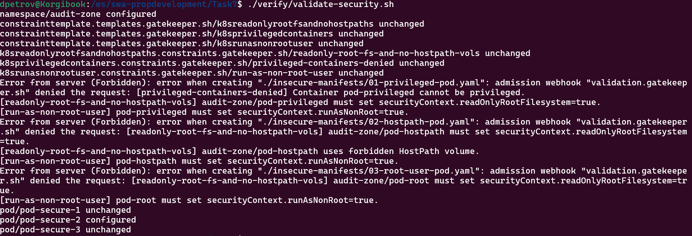

Как проверить POS Security Admission (у вас должен быть запущен minikube):

1. Из корневой директории Task7 запустите скрипт:
```
./verify/verify_admission.sh
```
2. Результат вывода и ошибки должны быть как на скриншоте: 


Как проверить Gatekeeper:

1. Установите в кластер Gatekeeper c помощью команды:
```
kubectl apply -f https://raw.githubusercontent.com/open-policy-agent/gatekeeper/v3.21.1/deploy/gatekeeper.yaml
```

2. Убедитесь что Gatekeeper запустился. Дождитесь, чтобы все компоненты имели статус Running.
```
kubectl get pods -n gatekeeper-system
```

3. Из корневой директории Task7 запустите скрипт: 
```
./verify/validate-security.sh
```
4. Результат вывода и ошибки должны быть как на скриншоте:

